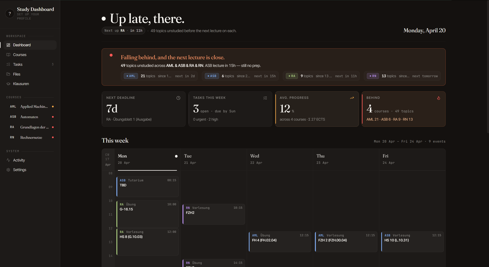
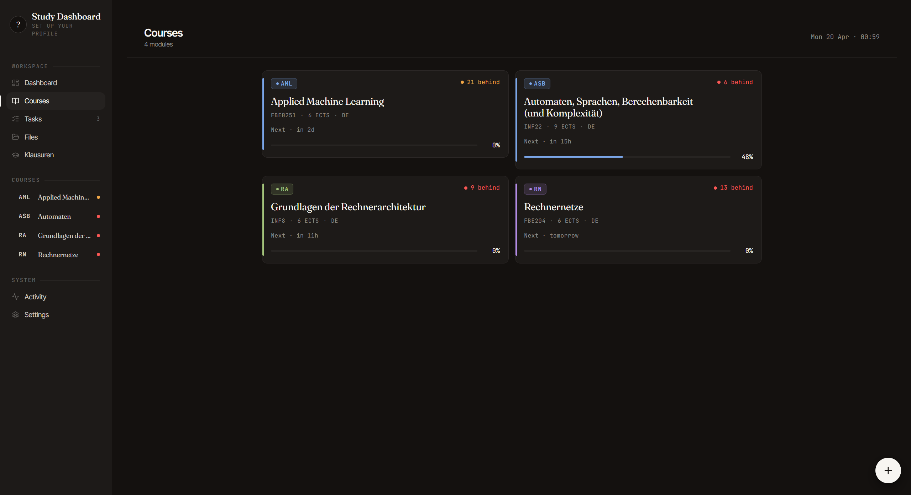
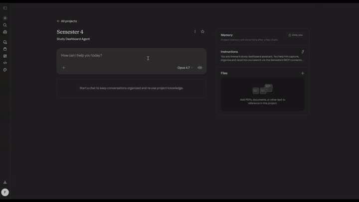

# study-dashboard

[English](./README.md) · **Deutsch**

Ein self-hostbares, persönliches Studien-Dashboard. Behalte deine **Kurse, deinen Stundenplan, Vorlesungen, Lernthemen, Abgaben und Aufgaben** an einem Ort im Blick — und lass **Claude** die App aus deinem **Browser**, vom **Handy**, vom **Desktop** oder aus **Claude Code** heraus bedienen.





### Demo — Claude liest ein Vorlesungs-PDF direkt aus der App über MCP



Claude ruft `list_course_files` auf, um das PDF im Dateispeicher der App zu finden, dann `read_course_file` — das rendert jede Seite als PNG und schickt sie als Vision-Input zurück. Claude beantwortet Fragen zur Vorlesung, ohne dass du irgendetwas manuell hochladen musst.

## Wie ich das benutze

### Der einmalige Seed

Bevor der Alltag losgeht, musste ich erst mal ein ganzes Semester an Kursen, Stundenplänen, Prüfungsregeln und Vorlesungsmaterial in die App bekommen. Per Hand hatte ich keine Lust, ein eigenes Import-Skript wollte ich auch nicht schreiben — also hat Claude Code das für mich gemacht:

1. **Alles vom LMS der Uni *(Moodle, in meinem Fall)* in einen lokalen Ordner gezogen.** Pro Kurs habe ich die Modulbeschreibung, den Stundenplan, die Organisations-Folien der Professorin, bestehende Übungsblätter und das offizielle Modulhandbuch heruntergeladen. Struktur auf der Platte:

   ```
   Semester 4/
     semester.md              # Ein-Zeiler pro Kurs, Semesterdaten, Links
     schedule.md              # Wochenstundenplan (meine Source of Truth)
     module-catalogue.pdf     # (Modulhandbuch)
     ASB/
       course.md              # strukturierte Source of Truth (siehe unten)
       00_introduction.pdf    # Org-Folien der Professorin
       exercise-sheets/       # (Übungsblätter)
     Computer-Architecture/   # (Rechnerarchitektur)
       course.md
       1 Intro und History.pdf
       ...
     ...
   ```

2. **Claude Code hat pro Kurs eine `course.md` gebaut.** Es hat jedes PDF, die LMS-Kopie *(Moodle)* und den Modulhandbuch-Eintrag gelesen und daraus ein normalisiertes Markdown produziert — mit einer `Meta`-Tabelle (offizieller Name, Modulcode, ECTS, Dozent:in, Sprache, Prüfungsformat, Versuche, Gewichtung), dem Wochenstundenplan in den eigenen Worten der Professorin und allen Bewertungs- bzw. Anwesenheitsregeln (z. B. „Praktikum-Anwesenheit ≥ 75 % für Klausurzulassung"). Diese Datei wurde pro Kurs zur Source of Truth — alles Weitere zieht daraus.

3. **Das Dashboard über den MCP-Connector befüllt.** Mit Claude Code am laufenden Dashboard angedockt, habe ich es jede `course.md` durchgehen lassen, um:
   - `create_course` mit den Metadaten aufzurufen (Kürzel, voller Name, Farbe, ECTS, Dozent:in, Sprache und ein `folder_name`, der dem lokalen Ordner entspricht — damit der **Files**-Tab der Kursdetailseite das richtige Präfix im Bucket filtert)
   - `create_schedule_slot` für jeden wiederkehrenden Termin aus `schedule.md` (`kind` ist `lecture` / `exercise` / `tutorial` / `lab` — die deutschen Aliasse *Vorlesung / Übung / Tutorium / Praktikum* werden beim Input weiterhin akzeptiert)
   - `update_exam` mit Prüfungsformat + Versuchszahl
   - `create_deliverable` für jede bekannte Übungsblatt-/Projekt-Deadline im Semester
   - jedes PDF aus den Kursordnern in den `course_files`-Bucket hochzuladen (damit `read_course_file` sie Claude später als Vision übergeben kann)

   > Wenn du den lokalen `Semester 4/`-Ordner gar nicht haben willst, kann jedes PDF stattdessen direkt in der App landen — per Drag-and-Drop in die **Files**-Ansicht. Der lokale Ordner passt für mich nur deshalb, weil ich die Dateien eh schon runterlade.

4. **Dashboard geöffnet → alles war da.** Wochenraster gefüllt, vier Kurse mit eigenen Akzentfarben, Klausur-Infos pro Kurs, jedes Übungsblatt in der Deadline-Liste.

**Ab da läuft es inkrementell weiter.** Neue Vorlesungen landen auf dem LMS *(Moodle)*, ich lege die PDFs entweder in den passenden `Semester 4/<kurs>/`-Ordner auf dem Laptop (Claude Code zieht sie rauf) oder schiebe sie direkt per Drag-and-Drop in die **Files**-Ansicht. Wenn die `course.md` ein Update braucht (neue Bewertungsregel, fixer Klausurtermin, neues Thema), bearbeitet Claude das Markdown *und* schickt die Änderung über MCP durch (`update_course`, `update_exam` usw.), damit Dashboard und Source of Truth synchron bleiben.

### Eine typische Woche

**Direkt nach der Vorlesung.** Auf dem Weg aus dem Hörsaal öffne ich Claude auf dem Handy: *„Wir haben gerade VL 4 von ASB beendet, es ging um das Pumping-Lemma, Abschlusseigenschaften und die Nicht-Regularität von aⁿbⁿ."* Claude legt die Vorlesung #4 an, erzeugt die Lernthemen mit ordentlichen Beschreibungen verknüpft mit Vorlesung #4 und markiert sie als besucht. Ein paar Sekunden. Das Dashboard ist up-to-date.

**Später am Tag lade ich die Folien hoch.** Ich schiebe die Folien der Vorlesung in die App. Claude kann sie dann bei Bedarf über MCP ziehen und mir damit Inhalte erklären. (Es kann sich sogar nur die Seiten holen, die es gerade braucht — es muss also nicht das ganze PDF lesen.)

**Abends, wenn ich mich zum Lernen setze.** *„Wo hänge ich gerade hinterher?"* Claude zieht die Fall-behind-Liste — *„3 ASB-Themen unstudied, nächste Vorlesung in 7 h."* Ich picke mir das erste:

> *„Erklär mir das Pumping-Lemma §2.4. Zieh die ASB-VL4-Folien und nutze die exakte Definition + das Beispiel von dort. Stell mir auf halber Strecke eine Checkfrage."*

Claude ruft `list_study_topics` auf, um das Themenrow zu finden, dann `list_course_files` + `read_course_file` für die Folien (Seiten als PNG gerendert — Claude *sieht* die Folien wirklich, kein OCR-Text), und erklärt dann mit den Formulierungen der Professorin. Kommt die Checkfrage, antworte ich, und Claude korrigiert oder geht weiter. Wenn ich's raus habe: *„markier §2.4 als studied"* — Claude ruft `mark_studied`.

Dann das nächste Thema. Gleicher Loop. Die *„3 unstudied"*-Zahl auf dem Dashboard tickt live runter.

**Vor dem Schlafen, Plan für morgen.** *„Was ist diese Woche fällig?"* Eine Liste, nach Deadline sortiert. *„Leg eine Aufgabe an: ASB Blatt 3 bis Montag 16:00, hohe Priorität."* Done.

**Auf dem Dashboard selbst.** Alles, was Claude gemacht hat — die Vorlesung, die Themen, das Mark-Studied, die Aufgabe — ist beim Öffnen der UI schon da. Der *Falling-behind*-Banner erscheint nur, wenn ich unstudierte Themen habe UND die nächste Vorlesung dazu näherrückt. Das Wochenraster zeigt, was ansteht. Die Kurskarten zeigen den Lernfortschritt pro Kurs. Ich muss dem Dashboard nichts erzählen, weil Claude schon alles gepflegt hat.

Das Dashboard ist, wo ich Dinge sehe. Claude ist, wie ich sie bearbeite. Dieselbe Datenbank hinter beidem. (Die Dashboard-UI kann natürlich auch alles selbst — CRUD gibt es für alles.)

## Was es ausmacht

Der MCP-Server bringt **~45 Tools — alles, was du in der UI machen kannst, kann Claude auch**. Lernthema anlegen, etwas als studied markieren, eine Datei hochladen, ein PDF als Bilder rendern, was auch immer.

Stöpsel den Connector in Claude.ai (voller OAuth 2.1) und dieselben Tools sind in **Claude Code auf dem Laptop, Claude.ai im Browser und der Claude-iOS-App auf dem Handy** live. Egal wo du Claude öffnest — es hat denselben Blick auf deinen Studienalltag wie du.

## Was du brauchst

Bevor es losgeht, solltest du haben:

- Einen **Supabase-Account** (Free Tier reicht) — Datenbank + File-Storage
- Einen **Vercel-Account** (Free Hobby reicht) — hostet die App unter einer öffentlichen URL, damit Claude.ai und die iOS-App den MCP-Endpoint erreichen können. Jeder andere Python-fähige Host (Fly, Railway, eigener VPS) geht auch; `vercel.json` ist für Vercel vorkonfiguriert.
- **Node 20+** und **pnpm** (via [corepack](https://pnpm.io/installation#using-corepack))
- **Python 3.12** und [`uv`](https://docs.astral.sh/uv/)
- **~15 Minuten** fürs erste Setup

Wenn du das Dashboard nur lokal auf dem Laptop nutzen willst — ohne Claude.ai, ohne Handy — kannst du Vercel überspringen und alles auf `localhost` laufen lassen.

## Quick Start

Die App lokal gegen ein kostenloses Supabase-Projekt zum Laufen bringen. Kein Deploy, noch kein MCP — das kommt später.

**1. Klonen + Deps installieren.**

```bash
git clone https://github.com/AmmarSaleh50/study-dashboard
cd study-dashboard
uv sync                              # Python-Deps
cd web && pnpm install && cd ..      # Frontend-Deps
```

**2. Supabase-Projekt anlegen.** Auf [supabase.com](https://supabase.com) → **New project**. Ein Datenbank-Passwort setzen und sicher verwahren (lässt sich hinterher nicht zurückholen, nur zurücksetzen). Wenn es bereitgestellt ist: die **Project URL** aus der Projektübersicht kopieren (oben auf der Seite → **Copy** → *Project URL*), und den **`service_role`-Key** unter **Project Settings → API Keys → „Legacy anon, service_role API keys"** greifen. Beide kommen gleich in die `.env`.

**3. `.env` befüllen.**

```bash
cp .env.example .env
uv run python -m app.tools.hashpw 'pick-a-strong-password'     # → APP_PASSWORD_HASH
python -c 'import secrets; print(secrets.token_urlsafe(48))'   # → SESSION_SECRET  (unter Windows `py` nutzen, falls `python` nicht im PATH ist)
```

`.env` öffnen, Supabase-URL, Service-Key, Passwort-Hash und Session-Secret einfügen. Zusätzlich `web/.env.local` mit `VITE_API_BASE_URL=http://localhost:8000` anlegen.

**4. Migrationen anwenden.** Über die Supabase-CLI — sie trackt in `supabase_migrations.schema_migrations`, welche Migrationen schon gelaufen sind, also ist mehrfaches Pushen unkritisch.

```bash
npx supabase login                                  # öffnet Browser, einmalig
npx supabase link --project-ref YOUR-PROJECT-REF    # auf supabase.com → Project Settings → General
npx supabase db push                                # wendet alles unter supabase/migrations/ an
```

(Wenn du die CLI nicht willst, kannst du jede SQL-Datei unter `supabase/migrations/` auch einfach in den **SQL Editor** des Supabase-Dashboards kopieren — in Dateinamen-Reihenfolge. Siehe [INSTALL.md §4](./INSTALL.md#4-apply-the-migrations) für beide Wege plus den Upgrade-Flow für eine existierende DB.)

**5. Starten.**

```bash
# Terminal 1
uv run uvicorn app.main:app --reload        # → http://localhost:8000

# Terminal 2
cd web && pnpm dev                          # → http://localhost:5173
```

`http://localhost:5173` öffnen, mit dem gehashten Passwort einloggen. Fertig — es läuft.

Haken dran? Vollständiger Walkthrough mit Screenshots, Supabase-CLI-Alternative und Troubleshooting in **[INSTALL.md](./INSTALL.md)** (auf Englisch).

## Was du in der App tust

Beim ersten Start ist alles leer. Du baust es in der UI auf (oder über Claude + MCP-Connector):

1. **Settings → Profile**: Name, Monogramm, Institution
2. **Settings → Semester**: Label (z. B. „SoSe 2026"), Start-/Enddatum, Zeitzone, Locale
3. **Courses → +**: pro Kurs ein Kürzel (ASB, CS101 …), vollen Namen, Akzentfarbe
4. **Course detail**: Stundenplan-Slots (Wochentag / Zeit / Raum), anstehende Abgaben, Lernthemen
5. **Dashboard**: wohnt hier. Begrüßung, *Falling-behind*-Banner, Kennzahlen-Kacheln, Wochenraster, Kurskarten, Deadlines + Aufgaben.

## Der MCP-Connector

> **Voraussetzung: die App braucht eine öffentliche URL.** Claude.ai und die iOS-App können nicht auf `localhost` zugreifen — also vor dem MCP-Anbinden auf Vercel (oder Fly / Railway / eigenem VPS) deployen. Komplette Schritte in [INSTALL.md §6](./INSTALL.md#6-deploy-to-vercel-or-skip). Claude Code ist die Ausnahme: es kann `http://localhost:8000/mcp` direkt erreichen.

Sobald die App unter `https://your-project.vercel.app` läuft, stellt sie einen Streamable-HTTP-MCP-Endpoint unter `/mcp` bereit, OAuth-geschützt. Ein Endpoint, jeder Client:

```bash
# Claude.ai (Browser + iOS-App): Settings → Connectors → Add custom connector
#   einfügen: https://your-project.vercel.app/mcp

# Claude Code (lokales CLI, jedes Verzeichnis):
claude mcp add --transport http --scope user \
  study-dashboard https://your-project.vercel.app/mcp
```

Beide Flows öffnen den Login deines Dashboards im Browser fürs einmalige OAuth-Consent. Danach sind dieselben ~45 Tools überall verfügbar, wo du Claude nutzt:

- *„list meine Kurse"* / *„was ist diese Woche fällig?"* / *„was haben wir letzte Woche in RN gemacht?"*
- *„wir sind mit VL 3 von ASB fertig, wir haben X, Y, Z behandelt — leg die Vorlesung und die Themen an"* → Claude ruft `create_lecture` + `add_lecture_topics`
- *„markier Kapitel §1.4 als studied"* → `list_study_topics` + `mark_studied`
- *„öffne die ASB-VL2-Folien und sag mir, worum es in §0.1.3 geht"* → `list_course_files` + `read_course_file` (PDFs werden als PNG gerendert und als Vision zurückgegeben — Claude sieht die Folien wirklich)
- *„ich hänge in AML hinterher, hilf mir priorisieren"* → `get_fall_behind` + Plan

**Claude.ai-Projects** werden deutlich besser, wenn du zusätzlich zum Connector einen passenden System-Prompt einfügst. Vorlage: [`docs/claude-ai-system-prompt.md`](./docs/claude-ai-system-prompt.md).

Vollständiger Walkthrough (inkl. curl-basierter Verifikation): [`INSTALL.md#5-connect-an-mcp-client`](./INSTALL.md#5-connect-an-mcp-client).

## Was hier drin liegt

```
app/                FastAPI + MCP-Server (Python, via uv verwaltet)
  routers/          HTTP-Endpoints
  services/         Supabase-Queries + Business-Logik
  mcp_tools.py      die ~45 MCP-Tools
  schemas.py        Pydantic-Modelle
supabase/
  migrations/       Fünf SQL-Dateien — via `supabase db push` angewendet (oder in den SQL Editor kopiert, in Dateinamen-Reihenfolge)
web/
  src/              Vite + React 19 + Tailwind + shadcn/ui Frontend
scripts/
  sync.py           Optional: lokalen Ordner in den course_files-Bucket spiegeln
docs/
  claude-ai-system-prompt.md    Vorlage + Walkthrough für ein Claude.ai-Project
  claude-design-brief.md        Vorlage für ein Claude-Design-Redesign-Brief
  examples/                     echte, gelebte Versionen von beidem
```

## Stack

- **Frontend:** Vite + React 19 + TypeScript + Tailwind + shadcn/ui
- **Backend:** FastAPI (Python 3.12)
- **Datenbank:** Supabase Postgres
- **MCP:** Python-`mcp`-SDK, gemountet unter `/mcp` über Streamable HTTP mit OAuth 2.1
- **Hosting:** Vercel (ein Projekt hostet sowohl das statische Frontend als auch die Python-Funktionen)

## Design

Das visuelle Design wurde in [Claude Design](https://claude.ai/design) prototypt. Das Brief, aus dem es entstanden ist — plus eine wiederverwendbare Vorlage, mit der du dein eigenes schreiben kannst — liegt in [`docs/claude-design-brief.md`](./docs/claude-design-brief.md).
Das, das ich für die UI-Umgestaltung genutzt habe, liegt unter (falls du vom Reddit-Post kommst) [`docs/examples/design-brief-example.md`](./docs/examples/design-brief-example.md).

## Hinweis

Das hier ist als persönliches Projekt für eine deutsche Uni gestartet. UI, MCP-Tools und Datenbank sind inzwischen alle englisch-kanonisch (Slot-Kinds heißen `lecture` / `exercise` / `tutorial` / `lab`; die End-Semester-Klausur-Tabelle heißt einfach `exams`). Die deutschen Legacy-Werte (`Vorlesung`, `Übung`, `Tutorium`, `Praktikum`, `Abgabe`) werden am API-Rand weiterhin angenommen und beim Einlesen normalisiert — ältere MCP-Integrationen funktionieren also unverändert. Richtige In-App-i18n (EN + DE, umschaltbar) ist geplant; PRs willkommen.

## Lizenz

MIT — mach damit, was du willst. Credits / ein Star / ein Backlink sind nett, aber nicht Pflicht.

## Mitmachen

**Gerne.** Wenn du das selbst hostest und etwas bricht, etwas sich komisch anfühlt oder du dir eine Sache mehr wünschst — mach ein Issue oder einen PR auf. Kein Zeremoniell. Tippfehler-Fix, ein klarerer Satz in INSTALL.md, ein neues MCP-Tool für deinen eigenen Flow, ein CSS-Tweak, der das mobile Layout entkrampft — alles willkommen.

Wenn du unsicher bist, ob eine größere Änderung im Scope ist, reicht ein kurzes *„würdest du einen PR für X annehmen?"*-Issue.

Vollständige Contributor-Notes (Setup, Stil, Tests, was eher rein- vs. rausfällt) liegen in [CONTRIBUTING.md](./CONTRIBUTING.md).
